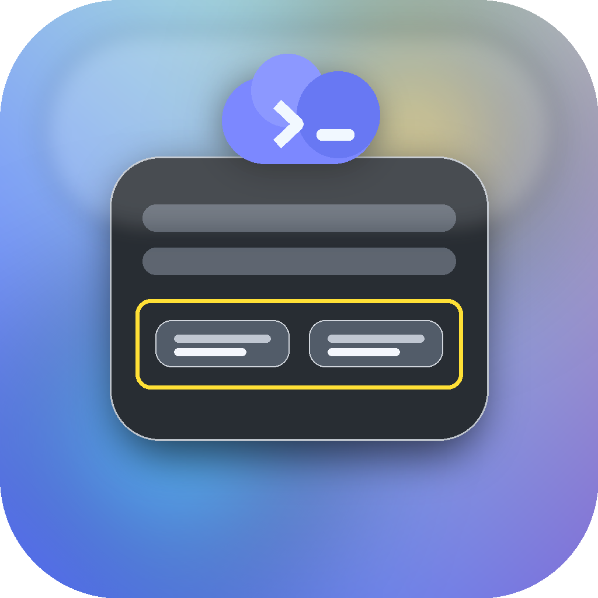

# Codex Reset Watcher



Unofficial macOS utility for checking banked Codex rate-limit reset credits.

It reads your existing local Codex Desktop login from `~/.codex/auth.json`, calls the same internal Codex Desktop endpoint used by the app, and shows available reset credits plus expiry dates in a normal window and menu-bar popover.

Codex Reset Watcher is read-only. It does not redeem resets or modify your account.

## Requirements

- macOS 14 or newer
- Codex Desktop installed and signed in

No API key is required.

## Install

1. Download `Codex Reset Watcher.zip` from the latest GitHub release.
2. Unzip it.
3. Drag `Codex Reset Watcher.app` into `/Applications`.
4. Open it.

If macOS warns that the app is from an unidentified developer, right-click the app and choose **Open**. Public distribution should use a Developer ID signed and notarized build.

## Build From Source

```bash
git clone https://github.com/jordan-edai/codex-reset-watcher.git
cd codex-reset-watcher
./script/build_and_run.sh --package
open "dist/Codex Reset Watcher.app"
```

The script uses SwiftPM and writes SwiftPM scratch files under `/tmp/codex-reset-watcher-build` to avoid file-provider issues in synced folders.

## What It Calls

```text
GET https://chatgpt.com/backend-api/wham/rate-limit-reset-credits
```

Headers are built from the existing Codex Desktop auth file. The app does not redeem resets, mutate account state, or store your token anywhere else.

## Privacy

See [PRIVACY.md](PRIVACY.md).

## Limitations

- This is unofficial and not affiliated with OpenAI.
- The endpoint is internal and may change without notice.
- The release app is ad-hoc signed unless a maintainer publishes a Developer ID notarized build.

## Maintainers

Package a release zip:

```bash
./script/package.sh
```

Regenerate the icon:

```bash
python3 -m pip install pillow
./script/make_icon.py
```

## License

MIT. See [LICENSE](LICENSE).
